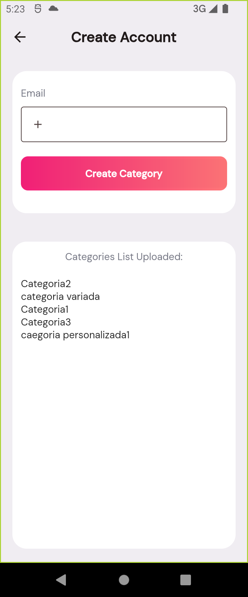

# Vault - melmv

Es una aplicacion movil para gestor de contraseñas:

- Creacion de cuenta con email(enviara verificacion de cuenta)
- Autenticacion de usuario con contraseña y correo electronico(pedira verificacion previa)
- Autenticacion de usuairo con cuenta gmail.
- Listar contraseñas
- Agregar contraseñas
- Eliminar contraseñas
- Agregar contraseña como favorito
- Crear categorias

### Login, Home y Crear contraseña

<p align="center">
  
  
  

### Crear cuenta y login con gmail

<p align="center">
  
  

### Crear categoria

<p align="center">
  

# Datos tecnicos

- Este proyecto esta usando firebase realtimeDatabase para almacenar informacion de categorias.
- Este proyecto esta usando gestores de estado sin paquetes, unicamente usando InheritedWidget y widgets de escucha como AnimatedBuilder.
- Pata la parte autenticacion se uso el servicio de firebase authentication, correo/contraseña y por gmail.

## Getting Started

```
flutter pub get
```

## Librerias usadas

```
google_fonts: ^6.0.0
firebase_core: ^2.4.1
firebase_auth: ^4.2.5
google_sign_in: ^5.3.2
firebase_database: ^10.2.5
```

## Estructura de bloc

### vaultBloc

#### Atributos

```
List<Vault> listVaults
```

#### Atributos

```
 void onEventAdd(Vault newVault)
 void onEventDelete(int position)
 void onEventFavVault(int index)
 void onEventDropList()
```

## Estructura de dato almacenado en realtime database

Firebase storage :

```
categorias[
    nameCategory:"Categoria",
    nameCategory:"Categoria"
]
```

## Anotaciones Adicionales

- Al momento de ingresar un correo para crear una cuenta, se enviara un correo y se tiene que verificar cuenta.
- Por le momento solo las categorias estan registrandose en firebase realtimeDatabase
- Las contraseñas estan siendo gestionadas por un bloc y gestion de estados.
- La configuracion del proyecto firebase tiene la huella digital de dispositivo de origen de este proyeco, pro que si es necesario una prueba enviar correo a bmoisesg@gmial.com para poder compartir por medio de correo electronico la invitacion de appTester
